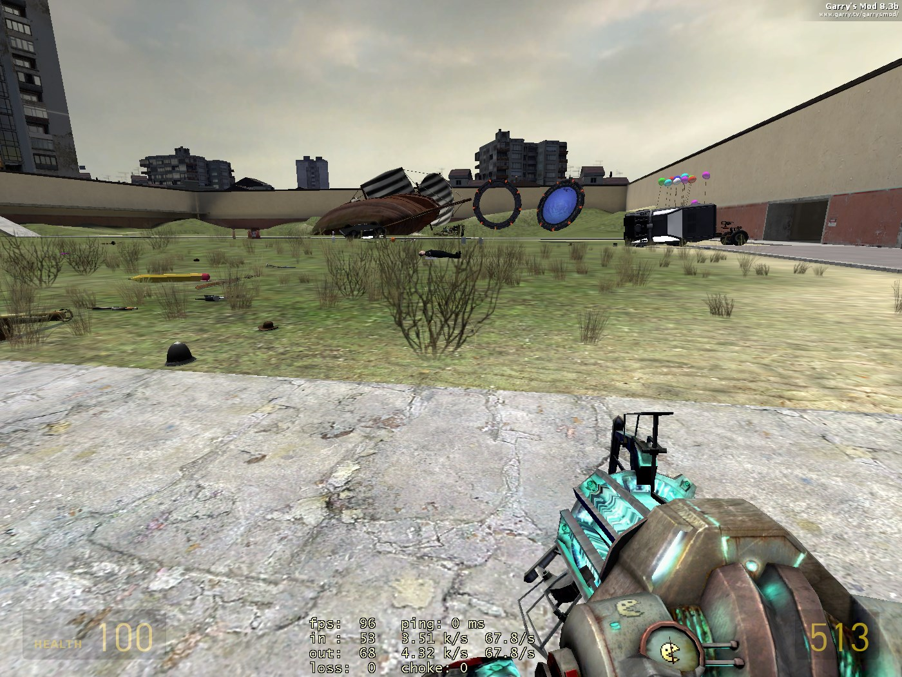
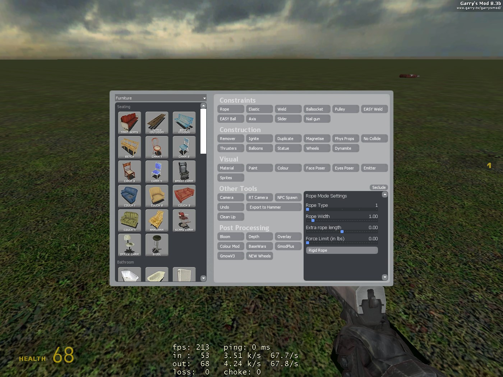
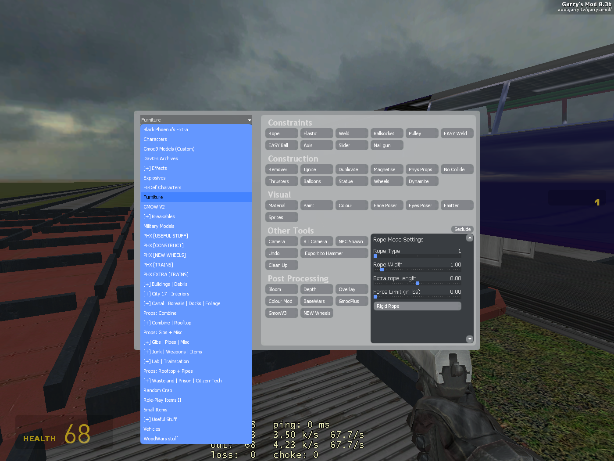
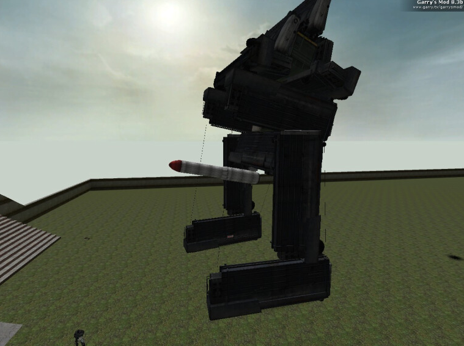

this is a collection of old gmod 8.3b resources (such as model packs, maps, mods, etc) from 2005 and 2006 distributed for archiving purposes
most of these are impossible to find online nowadays

where to get garry's mod 8.3b:

https://web.archive.org/web/20160819143930/https://facepunch.com/showthread.php?t=1027255

all of this might be completely and horribly broken as far as i know

**Known Credits**
* Tom's Spawn Menu Icons - Adds icons to the spawn menu (Tom Wiseman)
* Dav0rs Quick Pack - Dav0r
* rp_oviscity_b3 - Ovi on gamebanana.com
* rp_hometown1999 and tdm_hometown1999 - F.Kalkman
* GmodPlus - ReaperSWE

* everything by everyone else

**all the content belongs to their original creators whoever they may be**

if there is something in here that you don't want to be in here

or if you want credit, or know who made a certain thing in this archive

**make a pull request or hit me up at kei.trei.a52@gmail.com**

      
